# PromptAtrium Prompt Database Flow Architecture

> **Purpose:** Complete architectural analysis of frontend-backend-database communication for prompt operations  
> **Created:** December 2024  
> **Scope:** Comprehensive mapping for major redesigns

---

## Overview

This document provides a complete understanding of how PromptAtrium manages prompts across the frontend, backend, and database layers. It includes sequence diagrams, data flow mappings, and detailed object specifications to ensure consistency during redesigns.

---

## Sequence Diagram: Prompt Database Flow

```mermaid
sequenceDiagram
    participant User as Frontend User
    participant App as React App<br/>(TanStack Query)
    participant API as Express Backend<br/>(/api/prompts)
    participant DB as PostgreSQL<br/>(Drizzle ORM)
    
    Note over User,DB: USER CREATES A PROMPT
    User->>App: Click "Create Prompt"
    App->>App: Form validation (insertPromptSchema)
    activate App
    App->>API: POST /api/prompts<br/>{name, description, categories, tags, isPublic, ...}
    deactivate App
    
    activate API
    API->>API: Validate with insertPromptSchema
    API->>API: Generate ID (nanoid)
    API->>API: Extract userId from auth context
    API->>DB: INSERT INTO prompts<br/>(id, name, description, userId, isPublic, createdAt, ...)
    deactivate API
    
    activate DB
    DB->>DB: Write to prompts table
    DB-->>API: Return created Prompt object
    deactivate DB
    
    API-->>App: 200 OK<br/>{id, name, description, userId, ...}
    
    App->>App: Invalidate cache (queryKey: ['/api/prompts'])
    App->>App: Show success toast
    
    Note over User,DB: USER VIEWS PROMPT LIBRARY (FETCH)
    User->>App: Navigate to Library
    App->>App: Check cache (TanStack Query)
    
    alt Cache hit
        App-->>User: Display cached prompts
    else Cache miss
        activate App
        App->>API: GET /api/prompts?isPublic=true&limit=20&offset=0
        deactivate App
        
        activate API
        API->>DB: SELECT * FROM prompts<br/>WHERE isPublic = true<br/>ORDER BY createdAt DESC<br/>LIMIT 20
        deactivate API
        
        activate DB
        DB->>DB: Query with indexes<br/>(idx_prompts_public_created)
        DB-->>API: Return array of Prompt objects
        deactivate DB
        
        API-->>App: 200 OK<br/>[{prompt1}, {prompt2}, ...]
        
        App->>App: Store in TanStack cache
        App-->>User: Display prompts
    end
    
    Note over User,DB: USER LIKES A PROMPT
    User->>App: Click heart icon
    App->>API: POST /api/prompts/{id}/like<br/>{userId, promptId}
    
    activate API
    API->>DB: Check for existing like
    API->>DB: if not exists: INSERT INTO promptLikes
    API->>DB: UPDATE prompts SET likes = likes + 1
    deactivate API
    
    activate DB
    DB->>DB: Write to promptLikes table
    DB->>DB: Update likes count
    DB-->>API: Return updated Prompt
    deactivate DB
    
    API-->>App: 200 OK<br/>{...prompt, likes: 42}
    
    App->>App: Invalidate ['/api/prompts', id]
    App->>App: Update UI (likes count)
    
    Note over User,DB: USER EDITS A PROMPT
    User->>App: Edit prompt details
    App->>App: Form validation (partial insertPromptSchema)
    activate App
    App->>API: PATCH /api/prompts/{id}<br/>{name, description, tags, isPublic, ...}
    deactivate App
    
    activate API
    API->>API: Verify ownership (userId check)
    API->>API: Validate with partial schema
    API->>DB: UPDATE prompts<br/>WHERE id = {id}<br/>SET name = {name}, description = {description}, ...
    deactivate API
    
    activate DB
    DB->>DB: Update record
    DB-->>API: Return updated Prompt
    deactivate DB
    
    API-->>App: 200 OK<br/>{id, name, description, ...}
    
    App->>App: Invalidate ['/api/prompts', id]
    App->>App: Show success toast
    
    Note over User,DB: USER DELETES A PROMPT
    User->>App: Click delete button
    App->>App: Confirm action
    activate App
    App->>API: DELETE /api/prompts/{id}
    deactivate App
    
    activate API
    API->>API: Verify ownership
    API->>DB: DELETE FROM prompts WHERE id = {id}
    API->>DB: CASCADE delete from promptLikes, promptFavorites, etc.
    deactivate API
    
    activate DB
    DB->>DB: Delete from prompts
    DB->>DB: Delete related records (CASCADE)
    DB-->>API: Deletion confirmed
    deactivate DB
    
    API-->>App: 200 OK
    
    App->>App: Invalidate ['/api/prompts']
    App->>App: Navigate back to library
    
    Note over User,DB: USER ADDS TO COLLECTION
    User->>App: Select prompt + collection
    activate App
    App->>API: POST /api/prompts/bulk-add-to-collection<br/>{promptIds: [id1, id2], collectionId}
    deactivate App
    
    activate API
    API->>DB: INSERT INTO prompts_to_collections<br/>for each promptId
    deactivate API
    
    activate DB
    DB->>DB: Write junction table
    DB-->>API: Return success
    deactivate DB
    
    API-->>App: 200 OK
    
    App->>App: Invalidate ['/api/collections', collectionId]
    App->>App: Show success toast
```



---

## Core Data Objects

### 1. **Prompt (Main Object)**

**Database Table:** `prompts`

**Key Properties:**

| Field | Type | Required | Purpose | Example |
|-------|------|----------|---------|---------|
| `id` | char(10) | ✅ | Unique identifier | `abc1234567` |
| `name` | string | ✅ | Prompt title | "Cinematic Portrait" |
| `description` | text | ❌ | Detailed explanation | "Professional headshot..." |
| `promptContent` | text | ✅ | **The actual prompt text** | "A professional portrait of..." |
| `negativePrompt` | text | ❌ | What to exclude | "blurry, distorted, low quality" |
| `userId` | UUID | ✅ | Owner's ID | `user-uuid-123` |
| `isPublic` | boolean | | Public visibility | `true` |
| `isFeatured` | boolean | | Featured status | `false` |
| `isHidden` | boolean | | Hidden from search | `false` |
| `isNsfw` | boolean | | Content warning | `false` |
| `status` | enum | | Publication status | `"published"` \| `"draft"` \| `"archived"` |
| `categories` | text[] | ❌ | Category tags | `["Art", "Design"]` |
| `promptTypes` | text[] | ❌ | Prompt type | `["Image Generation"]` |
| `promptStyles` | text[] | ❌ | Style | `["Cinematic"]` |
| `tags` | text[] | ❌ | Search tags | `["portrait", "professional"]` |
| `tagsNormalized` | text[] | ❌ | Lowercase tags | `["portrait", "professional"]` |
| `exampleImagesUrl` | text[] | ❌ | Image URLs | `["http://cdn.../img1.jpg"]` |
| `likes` | integer | | Like count | `42` |
| `usageCount` | integer | | Times used | `125` |
| `qualityScore` | decimal(3,2) | | Rating 0-1 | `0.85` |
| `version` | integer | | Version number | `1` |
| `branchOf` | char(10) | ❌ | Parent prompt ID | `parent-id` |
| `createdAt` | timestamp | | Creation time | `2024-12-19T10:30:00Z` |
| `updatedAt` | timestamp | | Last update | `2024-12-19T14:45:00Z` |
| `subCommunityId` | UUID | ❌ | Community ownership | `community-uuid` |
| `subCommunityVisibility` | enum | | Community visibility | `"private"` \| `"parent_community"` \| `"public"` |

**TypeScript Types:**

```typescript
// From schema.ts
export type Prompt = typeof prompts.$inferSelect;

export type InsertPrompt = z.infer<typeof insertPromptSchema>;
```

**Frontend Usage:**

```typescript
// Fetching a prompt
const { data: prompt, isLoading } = useQuery({
  queryKey: ['/api/prompts', promptId],
  queryFn: () => apiRequest(`/api/prompts/${promptId}`)
});

// Type is: Prompt | undefined
```

---

### 2. **PromptLike (Engagement Tracking)**

**Database Table:** `prompt_likes`

**Purpose:** Track which users liked which prompts (one per user per prompt)

| Field | Type | Relationship |
|-------|------|--------------|
| `id` | UUID | Primary key |
| `userId` | UUID | References `users.id` |
| `promptId` | char(10) | References `prompts.id` |
| `createdAt` | timestamp | When the like was created |

**Unique Constraint:** `(userId, promptId)` - prevents duplicate likes

**Backend Usage:**

```typescript
// Check if user liked a prompt
const existingLike = await storage.getLike(userId, promptId);

// Create a like
await storage.createLike({ userId, promptId });

// Delete a like
await storage.deleteLike(userId, promptId);

// Get like count (reflected in prompts.likes field)
const likes = await db
  .select({ count: count() })
  .from(promptLikes)
  .where(eq(promptLikes.promptId, promptId));
```

---

### 3. **PromptFavorite (Bookmarks)**

**Database Table:** `prompt_favorites`

**Purpose:** Track user favorites/bookmarks (separate from likes)

| Field | Type | Relationship |
|-------|------|--------------|
| `id` | UUID | Primary key |
| `userId` | UUID | References `users.id` |
| `promptId` | char(10) | References `prompts.id` |
| `createdAt` | timestamp | When favorited |

**Unique Constraint:** `(userId, promptId)` - one favorite per user per prompt

---

### 4. **PromptCommunitySharing (Multi-Community Sharing)**

**Database Table:** `prompt_community_sharing`

**Purpose:** Share prompts with multiple communities

| Field | Type | Relationship |
|-------|------|--------------|
| `promptId` | char(10) | References `prompts.id` (PRIMARY KEY) |
| `communityId` | UUID | References `communities.id` (PRIMARY KEY) |
| `sharedBy` | UUID | References `users.id` |
| `sharedAt` | timestamp | When shared |

**Composite Key:** `(promptId, communityId)`

**Frontend Flow:**

```typescript
// User shares prompt with multiple communities
const sharePrompt = async (promptId: string, communityIds: string[]) => {
  // Calls: POST /api/prompts/{id}/visibility
  // Updates: prompt_community_sharing table
  // Sets: prompt.isPublic based on if in public community
};
```

---

### 5. **Collection (Prompt Organization)**

**Database Table:** `collections`

**Purpose:** Group prompts together

| Field | Type | Required | Purpose |
|-------|------|----------|---------|
| `id` | UUID | ✅ | Collection ID |
| `name` | string | ✅ | Collection title |
| `description` | text | ❌ | Description |
| `userId` | UUID | ❌ | Owner (if personal) |
| `communityId` | UUID | ❌ | Owner (if community) |
| `type` | enum | ✅ | `"user"` \| `"community"` \| `"global"` |
| `isPublic` | boolean | | Visibility |
| `createdAt` | timestamp | | Creation time |
| `updatedAt` | timestamp | | Update time |

**Related Table:** `prompts_to_collections` (Junction)

```typescript
export const promptsToCollections = pgTable(
  "prompts_to_collections",
  {
    promptId: char("prompt_id", { length: 10 }).references(() => prompts.id),
    collectionId: varchar("collection_id").references(() => collections.id),
  }
);
```

---

### 6. **PromptRating (User Feedback)**

**Database Table:** `prompt_ratings`

**Purpose:** Store per-user ratings of prompts

| Field | Type | Purpose |
|-------|------|---------|
| `id` | UUID | Rating ID |
| `userId` | UUID | Who rated |
| `promptId` | char(10) | What was rated |
| `rating` | integer | 1-5 stars |
| `review` | text | Optional review |
| `createdAt` | timestamp | When rated |

---

### 7. **Metadata & Extended Fields**

These are stored in JSONB columns for flexibility:

```typescript
// In prompts table
technicalParams: jsonb("technical_params"),     // {aspectRatio, resolution, etc.}
variables: jsonb("variables"),                  // {character: "", style: "", etc.}
additionalMetadata: jsonb("additional_metadata") // Custom fields
```

**Example Technical Params:**

```json
{
  "aspectRatio": "16:9",
  "resolution": "1024x1024",
  "samplingMethod": "Euler a",
  "steps": 30,
  "scale": 7.5
}
```

---

## API Endpoints Summary

### Create/Read/Update/Delete (CRUD)

| Method | Endpoint | Purpose | Auth Required |
|--------|----------|---------|---|
| `POST` | `/api/prompts` | Create prompt | ✅ User |
| `GET` | `/api/prompts` | List prompts | ❌ Public |
| `GET` | `/api/prompts/:id` | Get single prompt | ❌ Public |
| `PATCH` | `/api/prompts/:id` | Update prompt | ✅ Owner |
| `DELETE` | `/api/prompts/:id` | Delete prompt | ✅ Owner |

### Interactions

| Method | Endpoint | Purpose | Effect |
|--------|----------|---------|--------|
| `POST` | `/api/prompts/:id/like` | Toggle like | Updates `prompts.likes` |
| `POST` | `/api/prompts/:id/favorite` | Toggle favorite | Adds to `promptFavorites` |
| `POST` | `/api/prompts/:id/rate` | Rate prompt | Adds to `promptRatings` |
| `POST` | `/api/prompts/:id/branch` | Create copy | New prompt with `branchOf` |
| `POST` | `/api/prompts/:id/archive` | Archive prompt | Changes `status` to `archived` |
| `POST` | `/api/prompts/:id/hidden` | Hide from search | Sets `isHidden = true` |
| `POST` | `/api/prompts/:id/visibility` | Update visibility | Sets `isPublic` + `promptCommunitySharing` |

### Bulk Operations

| Method | Endpoint | Purpose |
|--------|----------|---------|
| `POST` | `/api/prompts/bulk-operations` | Batch update/delete/publish |
| `POST` | `/api/prompts/bulk-add-to-collection` | Add multiple to collection |
| `POST` | `/api/prompts/bulk-import` | Import multiple prompts |

### Specialized Features

| Method | Endpoint | Purpose |
|--------|----------|---------|
| `GET` | `/api/user/favorites` | Get user's favorited prompts |
| `GET` | `/api/user/likes` | Get user's liked prompts |
| `GET` | `/api/prompts/:id/communities` | Get communities this prompt is in |
| `POST` | `/api/prompts/:id/contribute-images` | Add images to prompt |
| `POST` | `/api/enhance-prompt` | AI enhancement |
| `POST` | `/api/prompt-refinement/chat` | AI refinement chat |

---

## Query Cache Strategy

**TanStack Query Cache Keys:**

```typescript
// List queries
['/api/prompts']                          // All public prompts
['/api/prompts', { filters: {...} }]      // Filtered list
['/api/user/favorites']                   // User's favorites
['/api/user/likes']                       // User's likes
['/api/collections', collectionId]        // Collection prompts

// Detail queries
['/api/prompts', promptId]                // Single prompt

// Invalidation patterns
// Create/Update/Delete → Invalidate related keys
await queryClient.invalidateQueries({
  queryKey: ['/api/prompts']
});

// Or specific prompt
await queryClient.invalidateQueries({
  queryKey: ['/api/prompts', promptId]
});
```

---

## Data Consistency Patterns

### Scenario 1: User Creates Prompt

**Frontend State:**
1. Form validation passes
2. Send POST to `/api/prompts`
3. Backend returns created prompt with ID
4. Invalidate `/api/prompts` cache
5. Refetch list (or update cache optimistically)

**Database State:**
1. New row in `prompts` table
2. `createdAt` and `updatedAt` set to now
3. All other fields populated from request

### Scenario 2: User Likes Prompt

**Frontend State:**
1. Click like button → Optimistic update (increment likes count)
2. Send POST to `/api/prompts/{id}/like`
3. Backend returns updated prompt
4. Invalidate `['/api/prompts', id]` cache

**Database State:**
1. New row in `promptLikes` (or delete if toggle-off)
2. `prompts.likes` count updated
3. User can like each prompt only once

### Scenario 3: User Shares Prompt to Community

**Frontend State:**
1. Select communities from list
2. Send POST to `/api/prompts/{id}/visibility`
3. Backend creates/deletes `promptCommunitySharing` rows
4. Sets `prompts.isPublic` if in any public community

**Database State:**
1. Entries in `promptCommunitySharing` table
2. Updated `prompts.isPublic` boolean
3. Community members can now see the prompt

---

## Design Considerations for Redesign

### Critical Constraints

⚠️ **Do NOT change:**
- Prompt ID format (char(10))
- promptContent field (core prompt text)
- userId reference (ownership)
- isPublic boolean (visibility control)

✅ **Safe to change:**
- Metadata structure (stored in JSONB)
- Optional fields (description, notes, etc.)
- Display/filtering logic (frontend only)
- UI/UX for prompt cards and forms

### Performance Implications

**Indexed Fields (Fast Queries):**
- `userId` - fetching user's prompts
- `isPublic, createdAt` - public feed
- `isFeatured` - featured section
- `subCommunityId` - community prompts

**Non-indexed Fields (Potential Slowdown):**
- `tags` (full-text search needed)
- `categories` (consider denormalization)
- JSONB fields (use `->` operators with care)

---

## Import/Export Consistency

When importing/exporting prompts, ensure:

```typescript
{
  // Required
  name: string,
  promptContent: string,
  userId: string,
  
  // Optional but commonly preserved
  description?: string,
  negativePrompt?: string,
  categories?: string[],
  tags?: string[],
  isPublic?: boolean,
  
  // Extended
  technicalParams?: object,
  variables?: object,
  exampleImagesUrl?: string[]
}
```

---

## Summary: Data Flow Recap

1. **Frontend** → User triggers action (create, edit, like, etc.)
2. **TanStack Query** → Validates with Zod schema, sends HTTP request
3. **Express API** → Authenticates, validates again, calls storage layer
4. **Storage Layer** → Builds Drizzle ORM query
5. **PostgreSQL** → Executes query, returns data
6. **Backend** → Returns JSON response
7. **Frontend** → Updates cache, UI reflects changes

**Key Principle:** Every change to prompts flows through this chain. Maintain this contract during redesigns to avoid breaking existing features.
